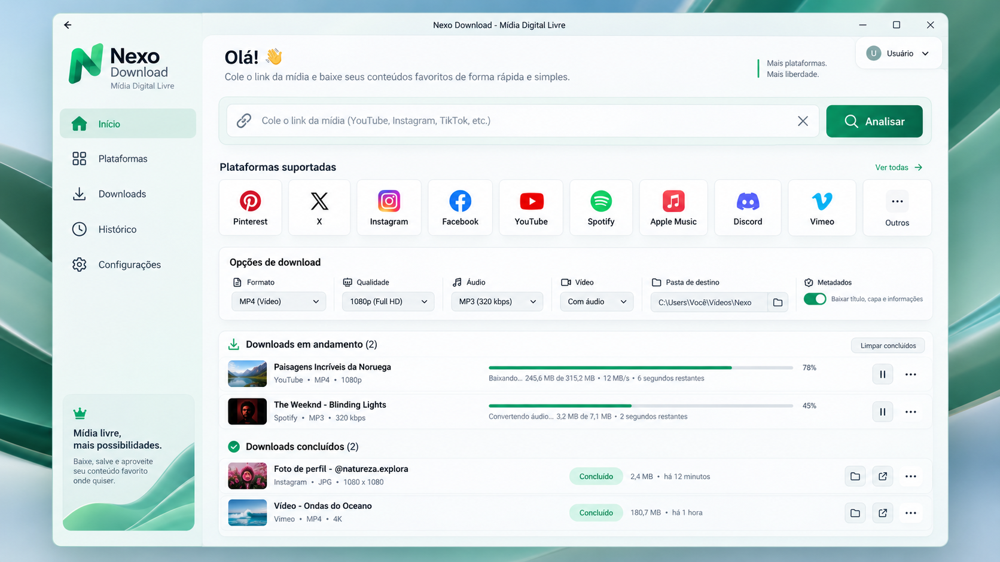

# ⚡ Nexo Download Pro — Mídia Digital Livre

<div align="center">



**Central Desktop de Download e Processamento Multimídia de Alta Fidelidade**  
*Blindagem C Nativa • Licenciamento HWID • Sessão Privê 18+ com Senha • Resolução Inteligente de Álbuns • Auto-Updater Silencioso*

[](https://www.python.org/)
[](https://cython.org/)
[](https://fastapi.tiangolo.com/)
[](https://microsoft.com)
[](https://github.com/junior-aguiar-eng/NexoDownload/releases)

</div>

---

## 📖 Visão Geral

O **Nexo Download Pro** é uma suíte desktop autônoma, veloz e elegante projetada para download, conversão e catalogação de áudio e vídeo de mais de 10 plataformas em qualidade máxima. 

Diferente de baixadores convencionais, o Nexo Download integra **injeção atômica de metadados oficiais** (capa HD embutida no Windows Explorer, artista, álbum, ano, gênero), processamento local via **FFmpeg**, motor inteligente de resolução de **álbuns e playlists completos** (Spotify e Apple Music), **Sessão Privê com proteção por senha** para conteúdo adulto (XVideos), blindagem antirreversa em código nativo C e instalador minimalista ultra silencioso.

---

## 🌟 Principais Recursos

### 1. 🎵 Resolução Inteligente de Álbuns & Playlists
- **Spotify & Apple Music:** Ao colar o link de um álbum (ex: *Sam Smith: Music Room*) ou playlist, o motor mapeia todas as faixas da coleção.
- **Faixas Individuais + Álbum Completo:** Salva em pasta dedicada todas as faixas separadas numeradas e tagueadas (`01 - Faixa.mp3`, `02 - Faixa.mp3`...) e simultaneamente cria o arquivo mesclado sem perdas (`{Álbum} (Álbum Completo).mp3`).

### 2. 🔞 Sessão Privê (Conteúdo Adulto Protegido por Senha)
- **Acesso Discreto no Topo (`Privê 🔒`):** Botão discreto no cabeçalho superior.
- **Proteção Obrigatória por Senha/PIN:** No primeiro uso, o usuário define uma senha mestra protegida via **SHA-256 + Salt aleatório** gravada de forma segura em `%APPDATA%\NexoDownload`.
- **Bloqueio Automático:** A sessão privê tranca automaticamente ao fechar o app ou ao clicar no botão *"Trancar"*.
- **Isolamento de Arquivos no Disco:** Qualquer download adulto ou do **XVideos** é salvo exclusivamente na subpasta dedicada `{Downloads}\Privê\`.
- **Histórico Oculto:** O histórico de downloads do app esconde todos os arquivos adultos quando a sessão estiver trancada. Ao digitar a senha, os itens reaparecem com a tag **`Privê 18+`**.
- **Redefinição Zero-Knowledge:** Caso esqueça a senha, é possível redefini-la pelas configurações sem deletar nenhum vídeo já baixado no computador.

### 3. 🎬 Metadados Atômicos & Capas em Alta Resolução
- **Vídeos MP4:** Capas oficiais embutidas diretamente no container MP4 através de atom tagging (`covr`), permitindo visualização de miniaturas no Windows Explorer e reprodutores de mídia.
- **Áudio MP3 320 kbps:** Tags ID3v2.4 completas com capa HD quadrada de alta resolução, nome do artista, álbum, número da faixa e data de lançamento.

### 4. 🛡️ Blindagem Antirreversa C-Native (6 Módulos)
- Os núcleos vitais da aplicação (`security_engine`, `prive_engine`, `spotify_engine`, `apple_music_engine`, `audio_processor`, `updater_engine`) são transcompilados para linguagem C e compilados como binários nativos de 64 bits (`.pyd` via Cython + MSVC C++).
- Os códigos-fonte em Python desses motores são completamente suprimidos dos pacotes de distribuição para proteção total de propriedade intelectual.

### 5. 🔐 Licenciamento Criptográfico HWID-Lock
- **Trava de Máquina Física:** Gera uma identidade única e inalterável (`HWID`) baseada no `MachineGuid` do Windows, UUID da placa-mãe e ID do processador.
- **Assinatura Criptográfica:** Licenças assinadas via HMAC-SHA256 com chave mestra AES, permitindo ativação offline instantânea de licenças permanentes ou com expiração temporal (ex: 30 dias).

### 6. 🎨 Interface Moderna & 5 Temas Visuais
- Design moderno com glassmorphism, microanimações e feedback de progresso em tempo real via WebSocket.
- Seletor nativo de pastas integrado à API do Windows Explorer (`/api/select-folder`).
- **5 Paletas de Cores:**
  - 🌲 **Esmeralda Profundo** (Padrão)
  - 🌊 **Ciano Cibernético**
  - 🔮 **Roxo Cósmico**
  - 🌅 **Sunset Neon**
  - 🔷 **Azul Noturno**

### 7. 🔄 Auto-Updater Silencioso em 1 Clique
- Comunicação direta com a API do GitHub Releases para checagem assíncrona de novas versões.
- Notificação modal amigável com visualização do *changelog*.
- Download em segundo plano com barra de progresso e aplicação silenciosa (`/S`) sem intervenção manual.

### 8. 📦 Instalador Minimalista com Fechamento Automático
- Instalador executável compilado via NSIS (`NexoDownload-Setup.exe`) no estilo Spotify/Discord.
- Card compacto (440x175 px) centralizado na tela, com acentuação nativa UTF-8 (*"Mídia Digital Livre"*).
- Sem banner de CD dos anos 90, sem botões de assistente e sem rodapé de copyright.
- **Fechamento Instantâneo:** Ao atingir 100%, fecha a janela do instalador automaticamente e já abre o aplicativo na hora.

### 9. 🎙️ Estúdio de Voz & IA (DSP + RVC Neural + Applio Clonador)
- **Motor 1 (DSP Tradicional):** Transposição de tom e ajuste timbral de formantes independentes via STFT vocoder (`stftpitchshift`) evitando artificialidades ("efeito esquilo"), com redução espectral estática de ruído (`noisereduce`). Presets prontos como Voz Grave, Agudo Natural, Locutor de Rádio e Personalizado.
- **Motor 2 (RVC IA Neural):** Conversão vocal hiper-realista baseada em modelos RVC v2 (`.pth`) e recuperação tímbrica por índice vetorial FAISS (`.index`) via algoritmo RMVPE, com aceleração automática por GPU (CUDA) e fallback para CPU.
- **Treinador de Voz Acoplado (Applio):** Pipeline nativo para criação de novas vozes personalizadas a partir de gravações curtas (5 a 15 min), fatiamento acústico, extração de embeddings e compilação direta na pasta de modelos do app.
- **Player de Áudio Integrado:** Reprodutor HTML5 embutido na interface gráfica com streaming em tempo real e exportação WAV 24-bit PCM em alta resolução.

---

## 🌐 Plataformas Suportadas

| Plataforma | Áudio | Vídeo | Recursos Especiais |
| :--- | :---: | :---: | :---: |
| **YouTube** | MP3 (320 kbps) | Até 4K HDR | Playlists, Canais e Capas HD no Explorer |
| **Spotify** | MP3 (320 kbps Master) | — | Álbuns completos, Playlists e Álbum Contínuo |
| **Apple Music** | MP3 (320 kbps Master) | — | Álbuns completos, Playlists e Álbum Contínuo |
| **XVideos (Privê)** | MP3 | MP4 (Até 1080p Full HD) | Protegido por Senha, Pasta `Privê/` e Histórico Oculto |
| **TikTok** | MP3 | MP4 HD Sem Marca | Vídeos individuais sem marca d'água |
| **Instagram** | MP3 | MP4 HD | Reels, Stories e Vídeos |
| **Twitter / X** | MP3 | MP4 HD | Vídeos e GIFs de tweets |
| **SoundCloud** | MP3 Original | — | Músicas e Sets com capas ID3v2 |
| **Twitch** | MP3 | MP4 HD | Clipes e VODs |
| **Facebook** | MP3 | MP4 HD | Vídeos públicos |
| **Pinterest** | MP3 | MP4 HD | Vídeos e Pins multimídia |

---

## 🚀 Como Executar em Desenvolvimento

### Pré-requisitos
- Python 3.11 ou superior (x64)
- Ferramentas de compilação C++ (Microsoft Visual C++ 14.0+ ou Visual Studio Build Tools)
- FFmpeg (disponível na pasta `bin/` ou no PATH do sistema)

### Instalação

```bash
# 1. Clonar o repositório
git clone https://github.com/junior-aguiar-eng/NexoDownload.git
cd NexoDownload

# 2. Criar e ativar o ambiente virtual (opcional, recomendado)
python -m venv venv
.\venv\Scripts\activate

# 3. Instalar as dependências
pip install -r requirements.txt

# 4. Compilar os módulos C nativos (.pyd)
python compile_pyd.py

# 5. Iniciar o aplicativo desktop
python main_desktop.py
```

O aplicativo iniciará o servidor local e abrirá automaticamente a janela do Nexo Download.

---

## 🔑 Gerador Administrativo de Licenças

Para gerar chaves de ativação para clientes vinculadas ao Hardware ID:

```bash
# Gerar licença permanente para um HWID de cliente
python gerador_licencas.py NEXO-XXXX-XXXX-XXXX

# Gerar licença com período de teste ou validade (ex: 30 dias)
python gerador_licencas.py NEXO-XXXX-XXXX-XXXX --dias 30
```

---

## 🏗️ Empacotamento do Instalador (Setup.exe)

Para compilar o pacote binário final e o instalador executável:

```bash
python build_installer.py
```

O script executará:
1. Compilação dos 6 motores em bibliotecas C nativas (`.pyd`).
2. Congelamento via PyInstaller com limpeza de arquivos `.py` desnecessários.
3. Incorporação do FFmpeg e dependências estáticas.
4. Geração do instalador NSIS minimalista em `dist/NexoDownload-Setup.exe`.
5. Fechamento automático configurado (`AutoCloseWindow true`).
6. Cálculo do hash criptográfico em `dist/SHA256SUMS.txt`.

---

## 📁 Arquitetura do Repositório

```plaintext
NexoDownload/
├── installer/
│   └── installer.nsi          # Script NSIS do instalador minimalista silencioso
├── web_app/
│   ├── app.py                 # Servidor de rotas e WebSockets (FastAPI)
│   ├── security_engine.py     # Motor HWID, hashing HMAC e validação de licença
│   ├── prive_engine.py        # Motor da Sessão Privê (SHA-256 + Salt e XVideos)
│   ├── spotify_engine.py      # Resolução de metadados de álbuns/playlists Spotify
│   ├── apple_music_engine.py  # Parser e extrator estruturado do Apple Music
│   ├── audio_processor.py     # Injeção ID3/MP4 e concatenação de álbuns
│   ├── updater_engine.py      # Verificador remoto e instalador de updates
│   ├── static/                # Estilos CSS, temas dinâmicos, JS e ícones
│   └── templates/             # Interface HTML5 moderna
├── main_desktop.py            # Ponto de entrada do executável desktop
├── compile_pyd.py             # Compilador Cython C-Native (.pyd)
├── build_installer.py         # Pipeline de build automatizado e instalador NSIS
├── gerador_licencas.py        # Utilitário CLI para geração de licenças
├── NexoDownload.spec          # Especificação de empacotamento PyInstaller
├── requirements.txt           # Dependências do projeto
└── version.json               # Manifest de versão do Auto-Updater
```

---

## 📄 Licença & Propriedade

Desenvolvido exclusivamente por **Junior Aguiar** ([@junior-aguiar-eng](https://github.com/junior-aguiar-eng)).  
Todos os direitos reservados.
